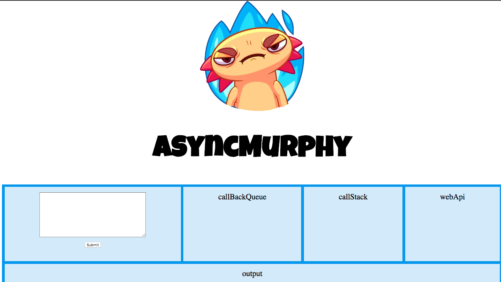

# asyncMurphy

 
  
 Designed to help developers understand the Node event event loop by animating the transition of functions from the call stack to the web api to the call back queue .  

  

 **AsyncMurphy is in active development. Follow this repo for contribution guidelines.**
## Getting Started

These instructions will get you a copy of the project up and running on your local machine for development and testing purposes.

### Prerequisites
Currently handling setTimeout only for the asynchronous function.

### Installing

To install locally, setup instructions are as follows:

1. `git clone --single-branch --branch master https://github.com/axolotlo/asyncMurphy.git`
2. `npm run build`
3. `npm start`

Type in you function enclosed in setTimout() and watch the the flow.

## Authors
[Dan Shu](https://github.com/danshuu) | [Franklin Pinnock](https://github.com/pinnockf) | [Kia Colbert](https://github.com/kiacolbert) | [Steven Rosas](https://github.com/srosas)

## License

This project is licensed under the MIT License - see the [LICENCE.md](./LICENCE) file for details

